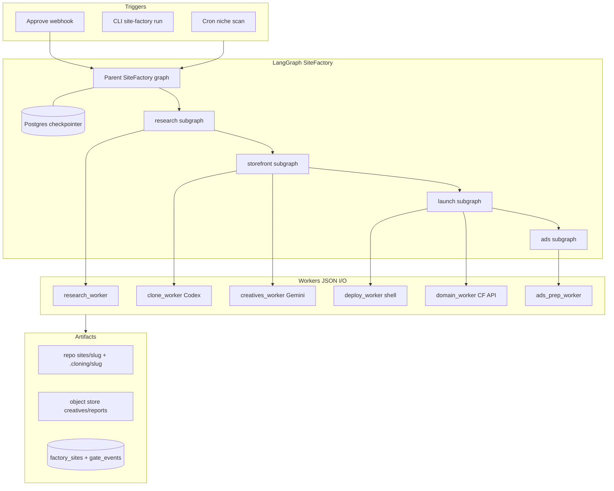
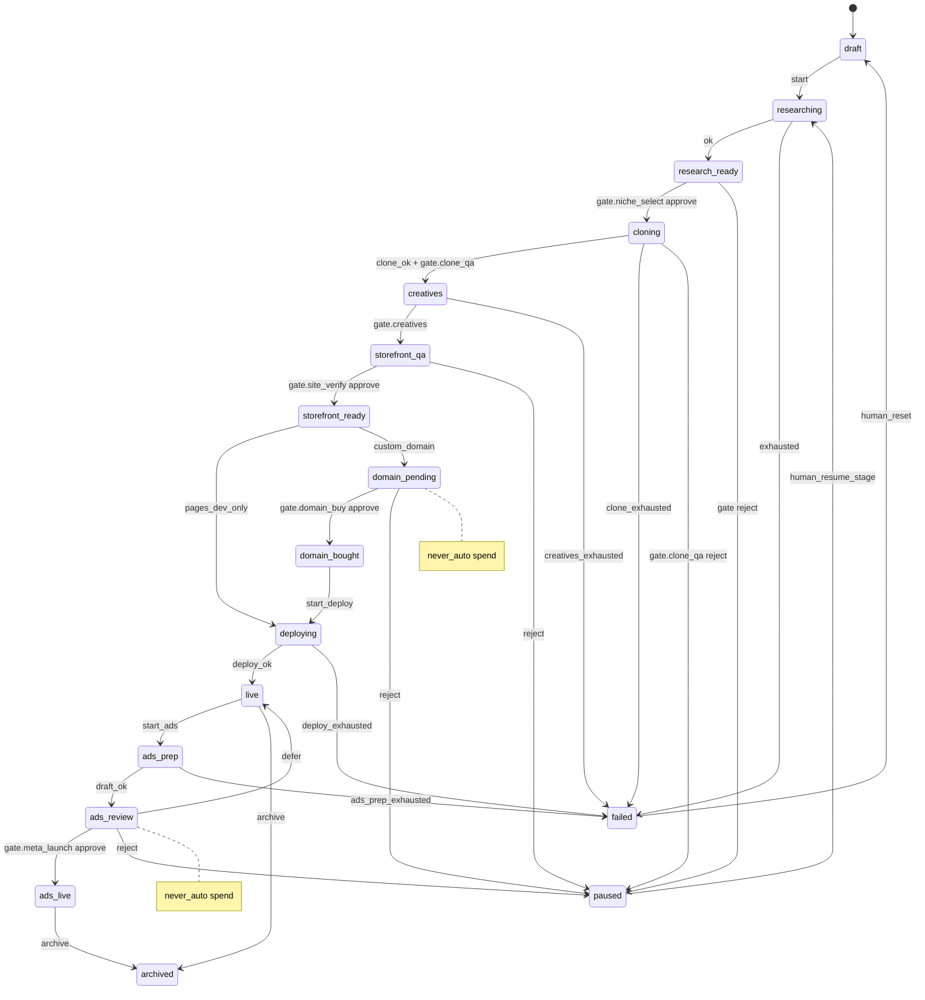
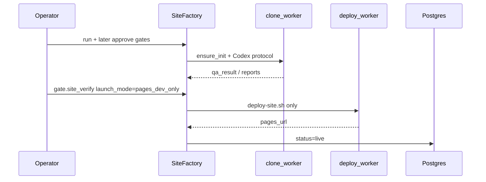

# Site Factory v1 — Semi-auto multi-tenant dropship pipeline (LangGraph)

| Field | Value |
|--------|--------|
| Status | **Approved** (design review, rev 2) |
| Audience | Platform / automation engineers |
| Repo | `ecomwebsite` (pnpm + Turborepo) |
| Related | `CloneWorkflow.md`, `tools/clone_workflow/`, `scripts/deploy-site.sh`, `notes.md`, `workflow.txt` |
| Out of tree (new) | `tools/site_factory/` (Python LangGraph spine) |

---

## Overview

v1 is a **semi-automatic site factory**: a durable LangGraph orchestrator runs staged pipelines (research → storefront → launch → ads) for each niche site, with **hard human gates** on spend and first-launch. Workers are JSON-contract subprocesses/APIs; only the storefront clone step invokes the existing Codex multi-agent clone workflow. State lives in a **site record + artifact store**, not chat history.

Triggers are **cron / CLI / webhook**, not an always-on personal agent.

---

## Background & Motivation

### Current platform

| Piece | Location | Role |
|--------|----------|------|
| Storefronts | `sites/<slug>` SolidStart SSG | Static CF Pages (`ecom-dropship-<slug>`) |
| Deploy | `scripts/deploy-site.sh <slug>` | Build → `wrangler pages deploy` only (no custom domain) |
| Bootstrap | `scripts/init-site.sh` (canonical; `notes.md` path is stale) | `.cloning/<slug>` + `sites/<slug>` from template |
| Clone tooling | `tools/clone_workflow/*`, `CloneWorkflow.md` | Helpers + multi-agent **protocol** (not one JSON CLI) |
| Commerce D1 (future) | `infra/d1/*.sql` | Tenants/sites/products — **not** factory state |
| Checkout | planned shared CF Worker (`notes.md`) | Out of factory v1 path |

### Pain

8-step business pipeline is mostly manual; clone has multi-agent contracts but nothing durably coordinates HITL, domain buy, or deploy. Codex alone is a poor multi-day orchestrator.

### Why LangGraph

Typed state + Postgres checkpointer + `interrupt()` for HITL; explicit retry edges; Codex demoted to clone worker only.

---

## Goals & Non-Goals

### Goals (v1)

1. Per-site lifecycle state machine + durable checkpoints.
2. Gate policy table (human / limited `auto_if` / never-auto), enforced via `evaluate_gate` on every gated edge.
3. Parent + 4 child subgraphs; JSON worker contracts.
4. Safe money paths: domain register + Meta launch fail-**closed** on spend; no silent charge retries.
5. Deploy only via `./scripts/deploy-site.sh`.
6. Artifact pointers on the site row; single active `thread_id` per site.

### Non-goals (v1)

| Out of scope | Notes |
|--------------|--------|
| Full multi-site autonomous loop | Multi-site over **time** OK; no unattended fan-out forever |
| Unattended Meta spend / budget ↑ | Always gated |
| DeepAgents / OpenClaw / Hermes | Skip |
| Rewriting Codex clone | Wrap protocol + helpers |
| Checkout Worker / CF for SaaS | Separate |
| Temporal/DBOS | Later if needed |
| Production SaaS factory UI | CLI + thin resume API |

---

## Key Decisions

| Decision | Choice | Rationale |
|----------|--------|-----------|
| Orchestrator | LangGraph + Postgres checkpointer | Multi-day HITL via `interrupt()` |
| Topology | Parent + research/storefront/launch/ads | Isolated retry policies |
| Status ownership | Row updated **in the same node** as transition; checkpoint = in-flight truth | Avoid dual-write races (see contract below) |
| Clone v1 runner | Operator machine: clone_worker runs extract helpers + blocks on Codex session; parses reports | No headless CI requirement for v1 |
| QA green signal | Heuristic parse of `reports/*.md` + optional `qa_result.json` sidecar | Tooling today has no structured booleans |
| Init | `ensure_init` (exists = success); no re-template without `reset` | `init-site.sh` is non-idempotent |
| Deploy vs domain | `deploy_worker` = shell script only; DNS/custom hostname = `domain_worker` | Matches real `deploy-site.sh` |
| Launch path | `pages_dev_only` **or** custom domain | Skip domain buy when flag set |
| Gates v1 | All human except optional `research_quality` + `clone_qa` | Freeze vague “first N / model score” for post-v1 |
| Spend workers | List-before-buy; ensure-state on same payload; new gate only if payload changes | Prevents double charge on resume |
| Concurrent runs | Reject new run if slug in git or DB unless `--force-resume` | One thread per site |
| State version | `SiteFactoryState.schema_version`; breaking → new thread | Avoid corrupt checkpoints |
| D1 | Not factory SoT | Commerce-shaped |
| Dogfood Postgres | Managed Postgres | Production-like durability for checkpointer + site rows |
| Domain suggest | `scripts/fetch_domains.py` (Namelix + CF check) | In-code generation already exists; domain_worker wraps it |
| Creatives storage | Git under `sites/<slug>` | Simple v1; accept binary/asset growth in repo |
| Clone runner (v1) | Operator machine only | Headless/CI clone deferred post-v1 |

---

## Proposed Design

### High-level architecture



### Parent + child pipeline topology

| Stage | Subgraph | Primary workers | Success exit |
|-------|----------|-----------------|--------------|
| Research | `research_pipeline` | research_worker | `research_ready` |
| Storefront | `storefront_pipeline` | ensure_init, clone, creatives | `storefront_ready` |
| Launch | `launch_pipeline` | domain (optional), deploy | `live` |
| Ads | `ads_pipeline` | ads_prep, ads_launch (gated) | `ads_live` or back to `live` |

**Launch modes** (set at `gate.site_verify` resume or run flags):

| Mode | Path |
|------|------|
| `pages_dev_only` | `storefront_ready` → `deploying` → `live` (no domain spend) |
| `custom_domain` | `storefront_ready` → `domain_pending` → (approve) → `domain_bought` → `deploying` → `live` → optional `domain_attach` |



**Gate → status on reject** (`on_reject`):

| Gate | Reject → | Notes |
|------|----------|--------|
| `gate.niche_select` | `paused` | Stay out of clone |
| `gate.research_quality` | `paused` or re-run research | Operator choice in payload |
| `gate.clone_qa` | `paused` | Artifacts kept |
| `gate.creatives` | `paused` | |
| `gate.site_verify` | `paused` | |
| `gate.domain_buy` | `paused` | Remain `domain_pending` until reject recorded then `paused` |
| `gate.deploy` | `paused` | Rare |
| `gate.meta_launch` | `paused` or stay `ads_review` | Default `paused` if reject; `defer` → `live` |
| `gate.budget_change` | no-op change | Never apply |

Business 8-step mapping:

| # | Step | Stage | Gate |
|---|------|-------|------|
| 1 | Niche | research | `gate.niche_select` |
| 2 | Ads library | research | `gate.research_quality` (optional auto) |
| 3 | Clone | storefront | `gate.clone_qa` |
| 4 | Creatives | storefront | `gate.creatives` |
| 5 | Site verify | storefront | `gate.site_verify` |
| 6 | Domain | launch | `gate.domain_buy` never auto (skipped if `pages_dev_only`) |
| 7 | Deploy | launch | `gate.deploy` auto if build ok |
| 8 | Ads | ads | `gate.meta_launch` never auto |

### Site record / status machine

**Control-plane SoT for operators/queries:** `factory_sites` row.  
**In-flight execution SoT:** LangGraph checkpoint for that `thread_id`.

```sql
CREATE TABLE factory_sites (
  id            UUID PRIMARY KEY,
  slug          TEXT UNIQUE NOT NULL,
  niche         TEXT NOT NULL,
  status        TEXT NOT NULL,
  launch_mode   TEXT NOT NULL DEFAULT 'pages_dev_only', -- or custom_domain
  risk_flags    JSONB NOT NULL DEFAULT '{}',
  thread_id     TEXT NOT NULL UNIQUE,  -- one active graph thread per site
  state_schema_version INT NOT NULL DEFAULT 1,
  checkpoint_ns TEXT,
  artifacts     JSONB NOT NULL DEFAULT '{}',
  worker_results JSONB NOT NULL DEFAULT '{}',
  gate_state    JSONB NOT NULL DEFAULT '{}', -- {pending_gate, interrupt_id, payload_preview}
  spend_ledger  JSONB NOT NULL DEFAULT '{}', -- order_id, campaign_id, last_payload_hash
  error         JSONB,
  created_at    TIMESTAMPTZ NOT NULL DEFAULT now(),
  updated_at    TIMESTAMPTZ NOT NULL DEFAULT now()
);

CREATE TABLE factory_gate_events (
  id         UUID PRIMARY KEY,
  site_id    UUID REFERENCES factory_sites(id),
  gate       TEXT NOT NULL,
  decision   TEXT NOT NULL,  -- approved | rejected | deferred | auto
  actor      TEXT NOT NULL,
  payload    JSONB,
  payload_hash TEXT,
  created_at TIMESTAMPTZ NOT NULL DEFAULT now()
);
```

**Status enum:**  
`draft` | `researching` | `research_ready` | `cloning` | `creatives` | `storefront_qa` | `storefront_ready` | `domain_pending` | `domain_bought` | `deploying` | `live` | `ads_prep` | `ads_review` | `ads_live` | `failed` | `paused` | `archived`

**Artifacts (examples):** `clone_workspace`, `site_path`, `pages_project`, `pages_url`, `custom_domain`, `creatives_uri`, `qa_report`, `reference_url`, `qa_result_json`

### Status vs checkpoint contract

| Rule | Detail |
|------|--------|
| Write path | Every graph node that changes lifecycle **calls repository.update_status** in that node (same step as returning new state). No deferred global `persist_status`-only design. |
| Resume | Load checkpoint by `thread_id`. If row `gate_state.pending_gate` lags checkpoint interrupt, **reconcile row from checkpoint** before accepting approve. |
| Crash after side effect | Workers must be **idempotent** (especially spend/deploy). Status may show pre-transition until node completes; operator `status` may show `deploying` while Pages already live — deploy_worker re-run is safe (same project). |
| Spend | **Never** re-invoke register/launch solely because status is `domain_pending` / `ads_review`. Require gate event + ensure-state (below). |
| `route_by_status` | Used only for **cold start** of a new invoke when no open interrupt; if checkpoint has pending interrupt, always resume that thread — do not start parallel subgraph from row status alone. |
| Breaking state schema | Bump `state_schema_version`; do not migrate old checkpoints — archive site or start **new thread** with explicit human reset. |

### Gate policy table

Module `gates/policy.py`. **Every** gated edge (parent or subgraph) **must** call `evaluate_gate`; unit-test each edge (PR2).

**v1 freeze:**

| Gate | v1 behavior | `auto_if` | never_auto | on_reject |
|------|-------------|-----------|------------|-----------|
| `gate.niche_select` | always human | — | no | pause |
| `gate.research_quality` | auto if predicates else human | `research_score_ok` | no | pause |
| `gate.clone_qa` | auto if predicates else human | `clone_qa_green` | no | pause |
| `gate.creatives` | always human | — | no | pause |
| `gate.site_verify` | always human | — | no | pause |
| `gate.domain_buy` | always human | — | **yes** | pause |
| `gate.deploy` | auto if `sites/<slug>/.output/public/index.html` exists post-build | `deploy_artifact_ok` | no | pause |
| `gate.meta_launch` | always human | — | **yes** | pause |
| `gate.budget_change` | always human | — | **yes** | no-op |

**Named predicates (constants in policy module):**

| Id | Definition |
|----|------------|
| `research_score_ok` | `top_niche.score >= RESEARCH_SCORE_MIN` (default **0.75**) and `len(competitors) >= 3` |
| `clone_qa_green` | `qa_result.json` present with `visual_pass==true` and `dom_pass==true`, **or** heuristic: `reports/final.md` exists and contains `PASS` (case-insensitive) and no `FAIL` in last 20 lines of visual/dom reports |
| `deploy_artifact_ok` | Build output `index.html` present before/after worker |

Post-v1 only: `first_N_sites`, `prior_live_count`, model-rated creatives — **not** implemented in v1.

```python
@dataclass(frozen=True)
class GatePolicy:
    name: str
    description: str
    never_auto: bool = False
    auto_if: str | None = None  # predicate id → function map
    on_reject: str = "pause"    # pause | fail | retry_stage
```

### LangGraph shape

```text
SiteFactory (parent)  state.schema_version = 1
  checkpointer: PostgresSaver
  nodes:
    load_site_record
    route_or_resume          # interrupt pending? resume : route_by_status
    call_research            # subgraph (includes gate.research_quality)
    gate_niche_select
    call_storefront          # subgraph: clone + gate.clone_qa + creatives + gate.creatives
    gate_site_verify         # sets launch_mode
    call_launch              # subgraph: optional domain gates + deploy + gate.deploy
    call_ads                 # subgraph: prep + gate.meta_launch + optional budget gate
```

Gates may live inside subgraphs; parent still owns `niche_select`, `site_verify`, and spend gates if launch/ads are inlined — **inventory must match table** (all nine names appear on some edge).

**HITL:**

```python
def gate_domain_buy(state):
    decision = interrupt({"gate": "gate.domain_buy", "slug": state["slug"],
                          "candidates": state["domain_candidates"], "est_cost_usd": ...})
    if not decision.get("approved"):
        return {"status": "paused", "gate_state": {}}
    return {"status": "domain_bought", "custom_domain": decision["domain"], ...}
```

**Resume auth (v1):** CLI/API must send `gate` matching `gate_state.pending_gate` (and thread_id/slug). Reject if gate already has terminal event for same `payload_hash`. Token = `FACTORY_APPROVE_TOKEN` (CLI dogfood; not browser CSRF-hardened).

### Sequence: pages.dev-only (minimal live)



### Worker contracts

**Envelope (all I/O):**

```json
{
  "schema_version": 1,
  "site_id": "uuid",
  "slug": "saunas",
  "trace_id": "…",
  "attempt": 1
}
```

**Exit codes:** `0` ok | `2` retryable | `3` fatal  

**Error body (exit 2/3):**

```json
{ "schema_version": 1, "error": { "code": "CLONE_TIMEOUT", "retryable": true, "message": "…" } }
```

Payload guidance: return **paths** to large reports, not full markdown inline (max ~256KB JSON).

#### `research_worker`

**In:** envelope + `{ niche_hint?, constraints }`  
**Out:** `{ niches: [{name, score, competitors:[{url, ads_count}], notes}], artifacts_uri }`

#### `clone_worker` (v1 runner — executable definition)

**Not** a single existing CLI. v1 driver:

1. **`ensure_init`:** If both `sites/<slug>` and `.cloning/<slug>` exist → no-op success. If neither → run `scripts/init-site.sh <slug>`. If only one exists → exit `3` `INIT_PARTIAL` (human `reset` required). Never re-copy template over partial clone without `reset: true` (deletes both paths then init — explicit only).
2. **Extract phase (automated):** Invoke `tools/clone_workflow` helpers (extractor / assets) as available for `reference_url`.
3. **Codex phase (operator machine default):** Launch/document the multi-agent coordinator per `CloneWorkflow.md` (planner-extractor → section-worker → integrator → visual/dom QA). Worker **blocks** until session completes or timeout (`agent_long` policy).
4. **QA parse:** Prefer `.cloning/<slug>/reports/qa_result.json` written by coordinator or a thin post-step:

```json
{ "schema_version": 1, "visual_pass": true, "dom_pass": true, "report_paths": ["…"] }
```

If missing, apply `clone_qa_green` heuristics on `reports/final.md`, `visual-qa.md`, `dom-functional.md`.

**In:** `{ slug, reference_url, init: true|false, reset: false }` — `init: true` means **ensure**, not “always run init-site”.  
**Out:** `{ site_path, clone_workspace, qa: {visual_pass, dom_pass, report_paths[]}, fatal_error? }`

Headless CI Codex is **out of v1** (open for later); dogfood = operator workstation.

#### `creatives_worker`

**In:** `{ slug, site_path, screenshots[], product_images_top_n, brand_notes }`  
**Out:** `{ creatives: [{type, path_or_uri, prompt}], provider: "gemini", needs_human: bool }`

#### `domain_worker`

| Mode | Behavior |
|------|----------|
| `suggest` | Candidates + prices; no charge |
| `register` | **Spend:** list-before-buy; if account already owns domain → success with `already_owned: true`; if `spend_ledger.order_id` set for same `payload_hash` → return stored result (**no second charge**); else place order, persist `order_id` **before** returning |
| `attach_hostname` | Map custom domain to Pages project via CF API (not `deploy-site.sh`) |

**Out register:** `{ domain, registrar: "cloudflare", order_id, already_owned?: bool }`

#### `deploy_worker`

**In:** `{ slug }` only  
**Behavior:** `CLOUDFLARE_API_TOKEN` + `CLOUDFLARE_ACCOUNT_ID` required; run `./scripts/deploy-site.sh <slug>` **only**. No custom domain attach.  
**Out:** `{ pages_project: "ecom-dropship-<slug>", pages_url: "https://ecom-dropship-<slug>.pages.dev" }`  
Idempotent re-deploy to same project is OK (`infra` retries).

#### `ads_prep_worker`

**Out `campaign_draft` required keys (v1):**

```json
{
  "objective": "conversions|traffic",
  "daily_budget": 0,
  "currency": "USD",
  "landing_url": "https://…",
  "creatives": [{ "type": "image|video", "uri": "…", "primary_text": "…", "headline": "…" }],
  "meta_account_ref": "…"
}
```

Plus `preview_uri`, `estimated_daily_budget`. **No publish.**

#### `ads_launch_worker` (gated)

Same ensure-state pattern as domain: list campaigns; if `spend_ledger.campaign_id` for payload_hash → return it; else create once; persist id. **Fail-closed** if Meta API ambiguous after timeout (status stays `ads_review`, human verifies in Ads Manager before re-approve with same or new payload).

### Failure / retry policy by risk class

| Risk class | Stages | Retry | On exhaust | Spend |
|------------|--------|-------|------------|-------|
| `cheap_compute` | research, creatives, QA parse | 3 exp | `failed` or human | n/a |
| `agent_long` | clone Codex | 2 full | `paused` / `gate.clone_qa` | n/a |
| `infra` | deploy | 3 | human | n/a |
| `spend` | domain register, Meta launch, budget | **0 auto retry** | **fail-closed** → human; no charge without gate | ensure-state only |
| `browser_flaky` | ads library scrape | 3 | partial + human | n/a |

**Spend rules (complete):**

1. **No auto retry** of register/launch on worker failure.
2. **Same approval payload** (`payload_hash`): resume may call worker again only as **ensure desired state** (list-before-buy / return existing `order_id`|`campaign_id`).
3. **New gate event** required when domain name, budget, or creative set changes (new hash).
4. Timeout after CF/Meta may have accepted: worker must query provider by client idempotency key / domain name before creating again; if unknown → fail-closed to human (do not assume “retry purchase”).
5. Exit `2` → graph retry only for non-spend classes; spend workers should exit `3` or `0` with ensure-state, never “retry charge”.

### Concurrency / slug uniqueness

- `run` rejects if `slug` exists in `factory_sites` **or** `sites/<slug>` (or `.cloning/<slug>`) unless `--force-resume` (reattach `thread_id`) or `--reset` (explicit destroy — gated separately).
- Research must propose slugs that pass the same check before `gate.niche_select` approve.
- One `thread_id` per `site_id`; no parallel parent graphs for same site.

### Package layout (new)

```text
tools/site_factory/
  README.md              # points to scripts/init-site.sh (not notes.md stale path)
  graph/ parent.py research.py storefront.py launch.py ads.py
  state.py               # schema_version = 1
  gates/policy.py
  workers/ base.py research.py clone.py creatives.py domain.py deploy.py ads.py
  db/ models.sql repository.py
  cli.py api.py
```

### Configuration

| Env | Purpose |
|-----|---------|
| `FACTORY_DATABASE_URL` | Postgres |
| `CLOUDFLARE_API_TOKEN`, `CLOUDFLARE_ACCOUNT_ID` | Deploy + domain APIs |
| `GEMINI_API_KEY` | Creatives |
| `FACTORY_APPROVE_TOKEN` | Resume CLI/API |
| `META_*` | Ads launch post-gate |
| `RESEARCH_SCORE_MIN` | Default 0.75 |

---

## API / Interface Changes

```bash
site-factory run --niche "home saunas" [--slug saunas] [--launch-mode pages_dev_only|custom_domain]
site-factory status --slug saunas
site-factory approve --slug saunas --gate gate.domain_buy --payload '{"domain":"…"}'
site-factory reject --slug saunas --gate gate.site_verify --reason "…"
site-factory list-pending
```

HTTP: `POST /factory/runs`, `GET /factory/sites/:slug`, `POST /factory/sites/:slug/resume`  
Resume body: `{ "gate", "decision", "payload", "actor" }` — must match pending gate.

---

## Data Model Changes

| Store | Change |
|-------|--------|
| Postgres | `factory_sites`, `factory_gate_events`, checkpoints |
| Git | `sites/<slug>`, `.cloning/<slug>` |
| Object store | Optional creatives |
| D1 | Unchanged |

---

## Alternatives Considered

| Alternative | Why not v1 |
|-------------|------------|
| Codex-only E2E | Weak HITL/spend safety |
| Mega-graph | Unreviewable |
| Temporal first | Premature |
| Always-on agent | Wrong failure modes |
| Auto domain/Meta | Financial risk |
| State only in checkpoints | Hard multi-site queries |

---

## Security & Privacy

| Risk | Sev | Mitigation |
|------|-----|------------|
| Unauthorized resume | High | Token; bind `gate` + pending; reject duplicate terminal decisions |
| Replay old approve | Med | Match `pending_gate`; payload_hash / gate_events |
| Secret leakage | High | Env only; redacted logs |
| Scrape ToS / IP | Med | Operator policy; minimal storage |
| Prompt injection | Med | Untrusted scrape → schema only |

---

## Observability

Structured logs (`trace_id`, `site_id`, `node`, `risk_class`); gate wait metrics; checklist on `status`; LangGraph thread inspect for interrupts.

---

## Rollout Plan

1. Skeleton + status/checkpoint contract + state_schema_version  
2. Deploy worker on real slug (`pages_dev_only`)  
3. Clone worker on operator machine + QA parse  
4. Research + creatives; all human gates  
5. Domain suggest → gated register (staging)  
6. Ads draft → gated launch  
7. Dogfood 1–2 niches  
8. Enable `research_quality` / `clone_qa` auto only after metrics  

---

## Risks

| Risk | Sev | Mitigation |
|------|-----|------------|
| Clone hours | Med | Status `cloning`; other sites independent threads |
| Double purchase | High | List-before-buy; spend_ledger; fail-closed |
| Status/checkpoint lag | Med | Contract above; ensure-state workers |
| Schema drift | Med | version + new thread |
| Operator bottleneck | Med | `list-pending` |

---

## Open Questions

### Decided (v1)

| Topic | Decision |
|-------|----------|
| Postgres host (dogfood) | **Managed Postgres** |
| Domain suggestions | **`scripts/fetch_domains.py`** — Namelix + CF availability check |
| Creatives storage | **Git under `sites/<slug>`** |
| Clone runner | Operator machine only; **headless/CI deferred post-v1** |

### Still open

None for v1 scope.

---

## References

- `AGENTS.md`, `notes.md` (stale init path: use `scripts/init-site.sh`), `CloneWorkflow.md`
- `scripts/deploy-site.sh`, `scripts/init-site.sh`, `tools/clone_workflow/`
- `workflow.txt` (discussion only)
- LangGraph checkpointers, `interrupt()`, subgraphs

---

## PR Plan

### PR1 — Factory skeleton: state, DB, CLI status

- **Title:** `feat(site_factory): Postgres site record + status enum + CLI status`
- **Files:** `db/*`, `state.py` (`schema_version`), `cli.py` status, README (canonical init-site path)
- **Deps:** none
- **Desc:** Schema incl. `launch_mode`, `spend_ledger`, `thread_id` UNIQUE; no graph.

### PR2 — Gate policy + edge unit-test harness

- **Title:** `feat(site_factory): gate policy table and evaluate_gate`
- **Files:** `gates/policy.py`, tests for all 9 gates + reject→status map
- **Deps:** PR1

### PR3 — Parent graph, checkpointer, stubs, state version rule

- **Title:** `feat(site_factory): parent graph HITL stubs + resume CLI`
- **Files:** `graph/parent.py`, stubs, `cli.py` run/approve/reject/list-pending
- **Deps:** PR1, PR2
- **Desc:** Full lifecycle incl. `pages_dev_only` edge; status writes in-node; **breaking state = new thread**; prove multi-day resume. Resume binds pending gate.

### PR4 — Research subgraph + worker

- **Title:** `feat(site_factory): research pipeline worker contract`
- **Files:** `graph/research.py`, `workers/research.py`
- **Deps:** PR3

### PR5 — clone_worker ensure_init + Codex driver + QA parse

- **Title:** `feat(site_factory): clone_worker driver and QA heuristics`
- **Files:** `workers/clone.py`, `graph/storefront.py` partial
- **Deps:** PR3
- **Desc:** ensure_init semantics; operator Codex session; `qa_result.json` / report heuristics.

### PR6 — Creatives worker

- **Title:** `feat(site_factory): creatives_worker Gemini hybrid`
- **Files:** `workers/creatives.py`, storefront complete
- **Deps:** PR5

### PR7 — Deploy worker (script only)

- **Title:** `feat(site_factory): deploy_worker → deploy-site.sh`
- **Files:** `workers/deploy.py`, launch partial
- **Deps:** PR3
- **Desc:** No custom domain; env token/account id; pages.dev URL on row.

### PR8 — Domain worker + spend ensure-state + attach_hostname

- **Title:** `feat(site_factory): domain suggest/register/attach spend-safe`
- **Files:** `workers/domain.py`, `graph/launch.py`
- **Deps:** PR2, PR7
- **Desc:** list-before-buy; spend_ledger; `pages_dev_only` vs custom_domain paths.

### PR9 — Ads prep + gated launch

- **Title:** `feat(site_factory): ads_pipeline draft + gated launch`
- **Files:** `graph/ads.py`, `workers/ads.py`
- **Deps:** PR6, PR8
- **Desc:** Typed `campaign_draft`; ensure-state Meta; never auto spend.

### PR10 — Thin resume HTTP API

- **Title:** `feat(site_factory): approve webhook`
- **Files:** `api.py`
- **Deps:** PR3 (CLI resume already in PR3)
- **Desc:** Token auth; pending-gate bind; audit list.

### PR11 — Dogfood runbook

- **Title:** `docs(site_factory): operator runbook`
- **Files:** README; optional notes.md fix pointer to `scripts/init-site.sh`
- **Deps:** PR7–PR9 for live path; PR5 for clone
- **Desc:** E2E checklist, failure playbooks, gate meanings.
